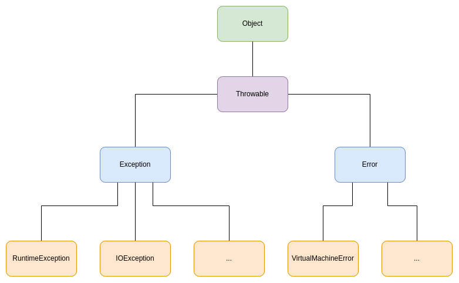

# Manejo de errores en Java

## Introducción

En programación, es habitual que surgan errores o interrupciones al ejecutar un programa desarrollado, ya sea por un error en el entorno o quizás algún escenario que no se tuvo en cuenta a la hora de programar.

Por ello, la práctica recomendada es la de controlar dichos errores por medio de excepciones. De esta manera, un programador puede anticiparse a un error durante la ejecución del programa.

## Tipos

Existen distintos tipos de errores que pueden surgir durante el desarrollo o ejecución de cierto código.

### Errores en tiempo de ejecución

Son errores encontrados durante la ejecución del programa. Pueden ser causados por diversos factores, como división por cero, desbordamiento de memoria, índices inválidos, etc.

### Errores de compilación

Son errores que impiden la compilación del programa, como lo puede ser un error de sintaxis. Dichos errores impiden la creación del archivo ejecutable.

### Errores lógicos

Aunque el programa compile y logre ejecutarse, pueden surgir errores "lógicos" que no son detectados por el sistema. Es decir, son errores que implican que el programa no haga lo que debería, o lo hace de una manera erronea.

## Excepciones

Una excepción es un evento que ocurre durante la ejecución del programa y que interrumpe el mismo.

Se pueden dividir en dos tipos:

- Comprobadas: deben ser declaradas en la firma del método utilizando un `throw`, o deben ser manejadas con bloques `try-catch`. Son las subclases de `Exception`, pero no las de `RuntimeException`.
- No comprobadas: no requieren dicha declaración. Son subclases de `RuntimeException`.

## Jerarquía

Lo errores y excepciones en Java presentan la siguiente jerarquía:



## Manejo de errores

A raíz de estas interrupciones que surgen durante la ejecución del programa, se recomienda manejarlas y poder controlar el funcionamiento de la aplicación. Para cumplir con tal fin, se pueden utilizar los bloques `try-catch-finally`, que se componen de:

- Bloque `try`: es el bloque de código que se desea ejecutar y puede generar una excepción. En caso de que se interrumpa, se busca el bloque `catch` para manejar dicha excepción.
- Bloque `catch`: captura las excepciones que se producen dentro del bloque `try`.
- Bloque `finally`: se declara después de los otros dos bloques antes mencionados, y ejecuta el código que contiene, haya aparecido o no una excepción. Se suele utilizar para limpiar recursos y cerrar conexiones.

Además, siempre se pueden anidar los catch, considerando cada una de las excepciones que pueden surgir al ejecutar el código. Incluso, es recomendable tener un catch genérico al final de los bloques, que tome cualquier caso que pudo no haber sido contemplado en los bloques `catch` anteriores. Para dicho fin, se puede utilizar la excepción `RuntimeException`.

### Ejemplo

```java
public class Main {
    public static void main(String[] args) {
        try {
            // Código que puede lanzar una excepción
            int[] arreglo = {1, 2, 3};
            System.out.println(arreglo[5]);
        } catch (ArrayIndexOutOfBoundsException e) {
            // Manejo de la excepción de tipo ArrayIndexOutOfBoundsException
            System.out.println("Error de índice en array.");
        } catch (NullPointerException e) {
            // Manejo de la excepción de tipo NullPointerException
            System.out.println("Error de puntero nulo.");
        } catch (RuntimeException e) {
            // Manejo de cualquier otro tipo de excepción
            System.out.println("Error desconocido.");
        } finally {
            // Código que se ejecuta siempre, haya o no excepción
            System.out.println("Fin del bloque try-catch.");
        }
    }
}
```

### Excepciones personalizadas

Además, se pueden crear excepciones personalizadas, que no son más que clases que extienden a la clase base `Exception`, o alguna de sus subclases.

---

```java
public class ExcepcionPersonalizada extends Exception {
    public ExcepcionPersonalizada() {
        super();
    }

    public ExcepcionPersonalizada(String mensaje) {
        super(mensaje);
    }
}
```

Y, desde el programa principal, se puede invocar de la siguiente manera:

```java
public class Main {
    public static void main(String[] args) {
        try {
            throw new ExcepcionPersonalizada("Esta es una excepción personalizada.");
        } catch (ExcepcionPersonalizada e) {
            System.out.println("Se produjo una excepción personalizada: " + e);
        }
    }
}
```

## Conclusiones

Cabe destacar la importancia de manejar adecuadamente los errores y excepciones en el desarrollo de software, para poder tener una aplicación más estable, funcional y escalable.

Para cumplir con dicho objetivo, la herramienta principal es el bloque `try-catch`, que ejecuta código y atrapa las excepciones que surjan.
